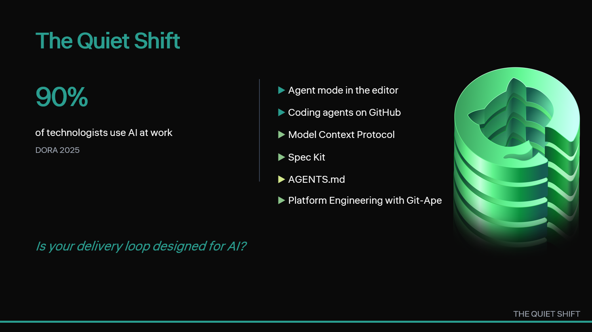

[Back to home](../index.md)

Slide 02 · 0:30 to 2:00

## The Thought

Something already changed. Most teams haven't noticed.

## Slide Copy

- 2024 to 2026: a stack of compatible primitives
- Agent mode, coding agents, MCP, Spec Kit, AGENTS.md
- ~90% of technologists use AI at work (DORA 2025)
- New question: is your *loop* designed for AI?

Speaker notes

> "Between the day Copilot suggested its first line of code and the day it started opening its own pull requests, something quietly shifted. It didn't arrive as one launch. It arrived as a stack: agent mode in the editor, coding agents on GitHub, the Model Context Protocol standardizing how tools plug into models, Spec Kit making the specification a durable artifact, AGENTS.md becoming the file where we tell AI teammates how to behave. The 2025 DORA report tells us roughly 90 percent of technologists now use AI at work. So the question is no longer *are you using AI*. The question is: *is your delivery loop designed for AI, or are you still bolting AI onto a loop designed without it?*"

