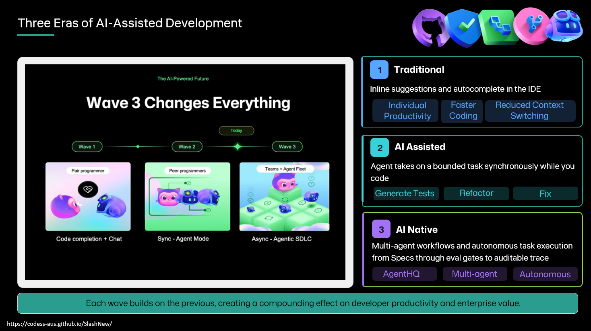

<a class="sn-back" href="../index.md">← Back</a>

Foundation

# Three Eras, Side by Side

*Give the audience a vocabulary so they can locate themselves on the map.*

## Why this chapter matters

Shared language reduces confusion. This chapter helps teams distinguish traditional, AI-assisted, and AI-native ways of working without overclaiming maturity.

## Key points for your team

This chapter is a positioning tool. It helps teams avoid speaking past each other by defining concrete differences between traditional, AI-assisted, and AI-native loops.

Use it to make planning discussions more honest: if the loop has not changed, you are optimizing execution speed, not redesigning delivery. That distinction is useful, especially when prioritizing platform and governance investments.

## Put this into practice

Choose the row in the maturity table that best describes your current loop and define one change needed to move to the next stage.
