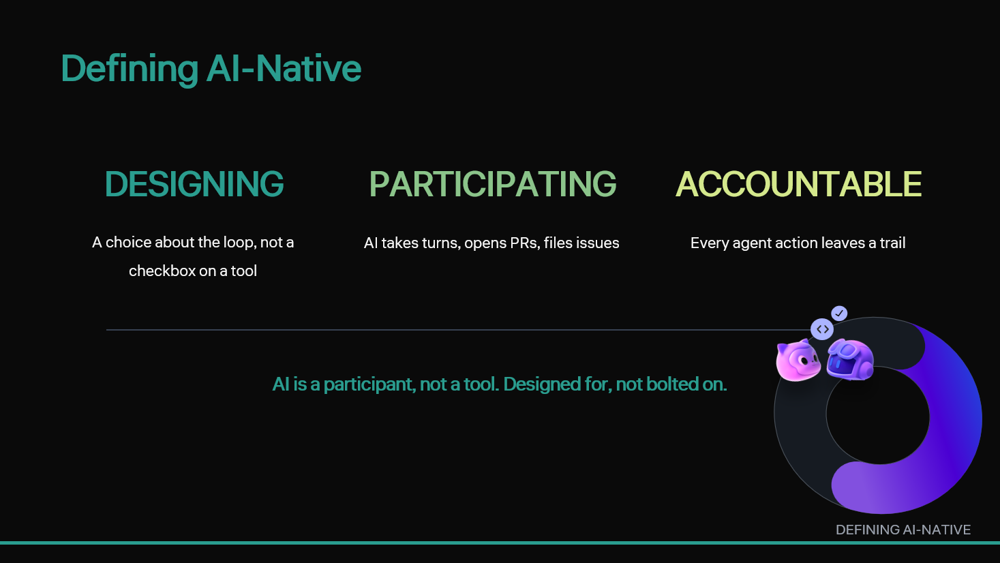

<a class="sn-back" href="../index.md">← Back</a>

Foundation

# Defining AI-Native

*A definition you can hold a team accountable to.*

## Why this chapter matters

A practical definition keeps teams aligned. AI-native delivery treats AI systems as accountable participants, not as hidden automation behind developer tools.

## Key points for your team

Definitions matter because they influence architecture, risk posture, and team expectations. Here, AI-native means AI participates in the workflow in ways that can be reviewed and governed, not merely assisted by autocomplete.

For conference attendees, this is a useful standard to carry home: if contribution cannot be traced and reviewed, it should not be treated as production-ready regardless of how fast it was produced.

## Put this into practice

Add explicit ownership and auditability requirements to your team definition of done for any AI-assisted or agent-generated change.
