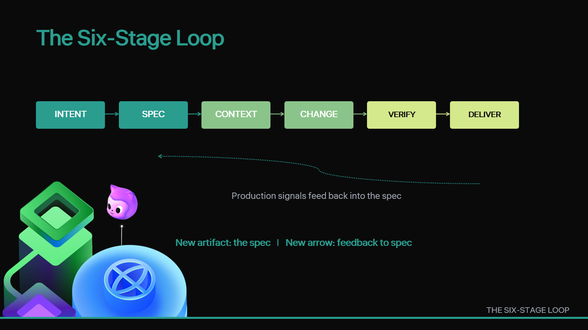

[Back to home](../index.md)

<p class="chapter-meta">Slide 05 · 4:30 to 6:30</p>

<div class="chapter-hero">

</div>

## The Thought

Show the anatomy. This is the spine of the rest of the talk.

## Slide Copy

```
INTENT → SPEC → CONTEXT → CHANGE → VERIFICATION → DELIVERY
   ↑___________________________________________________|
          production signals feed back into the spec
```
- New artifact: **spec**
- New arrow: **feedback to spec**

<details class="speaker-notes">
<summary>Speaker notes</summary>

> "Six stages. Intent: captured deliberately, not in a Slack thread. Spec: an artifact in the repo, brief and reviewable in five minutes. Context: engineered through AGENTS.md, MCP servers, and per-task context packets. Change: made by a human, by agent mode, or by the coding agent, anchored on the spec. Verification: layered from cheap to expensive: tests, evaluators, policy gates, human review. Delivery: ships through your existing CI/CD and feeds production signals *back into the spec*, not just the backlog. The new artifact at the start is the spec. The new arrow at the end is the feedback into the spec. Everything else is rebalanced, not reinvented."

</details>
