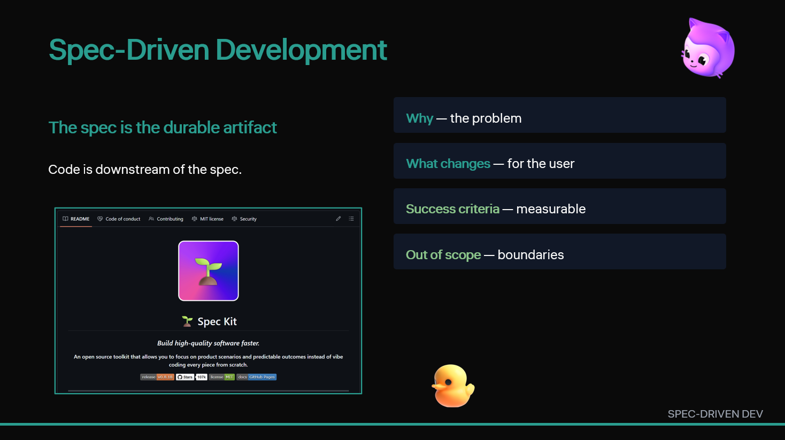

<a class="sn-back" href="../index.md">← Back</a>

Workflow

# New Workflows: Spec-Driven Development

*The spec is the durable artifact. Code is downstream.*

## Why this chapter matters

Spec-driven development reduces rework and ambiguity. It gives humans and agents a shared contract before implementation starts.

## Key points for your team

Spec-driven work shifts debate to the right moment: before code is written. This reduces ambiguous implementation paths and helps both humans and AI systems align on expected outcomes.

As a conference companion takeaway, think of the spec as the minimum shared contract for change. Even brief specs can dramatically improve review quality, handoffs, and post-release accountability.

## Put this into practice

Use a short spec template with goal, user impact, success criteria, and out-of-scope for every non-trivial change.
