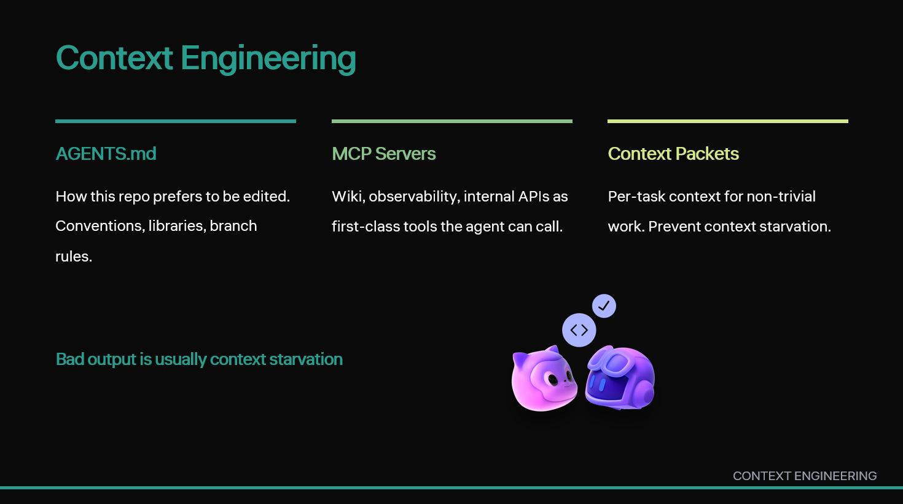

[Back to home](../index.md)

Slide 08 · 9:00 to 10:30

## The Thought

Context is the second-most-important investment after the spec.

## Slide Copy

- **AGENTS.md** — how this repo prefers to be edited
- **MCP servers** — wiki, observability, internal APIs as tools
- **Per-task context packets** for non-trivial work
- Bad output is usually **context starvation**

Speaker notes

> "Context is engineered, not assumed. Three layers. First, AGENTS.md: a plain Markdown file in the repo that tells agents how this codebase prefers to be edited. What library to use for dates. Which branches it can push to. Which conventions are non-negotiable. Second, MCP servers: the Model Context Protocol lets you expose your wiki, your observability platform, your internal APIs as first-class tools the agent can call. Writing a custom MCP server is a weekend project, not a quarter-long migration. Third, per-task context packets for non-trivial work. When an agent produces code that is locally plausible and globally wrong, the cause is almost always context starvation. Fix context, fix the agent."

