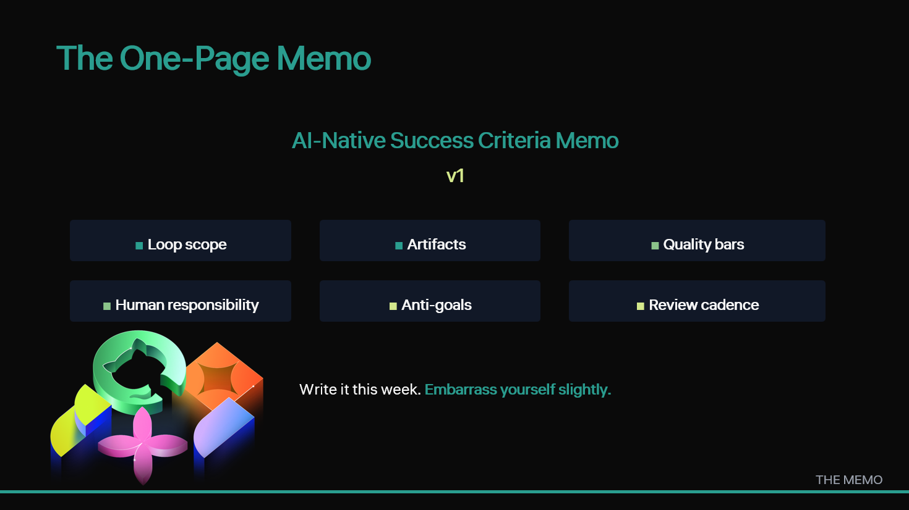

[Back to home](../index.md)

Slide 14 · 18:00 to 19:00

## The Thought

Give them something they can implement on Monday.

## Slide Copy

- **AI-Native Success Criteria Memo v1**
- Loop scope · Artifacts · Quality bars
- Human responsibility · Anti-goals · Cadence
- Write it this week. Embarrass yourself slightly.

Speaker notes

> "Here is what I want you to take back. One page. The AI-Native Success Criteria Memo. Loop scope: when do *you* consider your loop AI-native? Artifact criteria: what does every change retain? Quality bars: what blocks a merge? Human responsibility: *which* human, named by role? Anti-goals: what are you deliberately not optimizing for? Review cadence: quarterly, with an owner. Write v1 this week. It should be slightly embarrassing in its specificity, not polished for a slide. A bar the team routinely ignores teaches everyone the memo is decorative. The memo is a target, not a description of done. But it's the artifact that turns this talk into practice."

