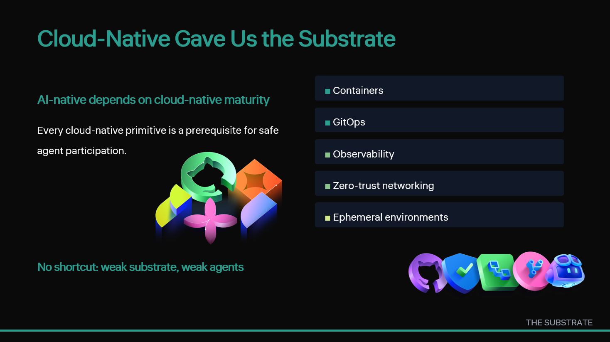
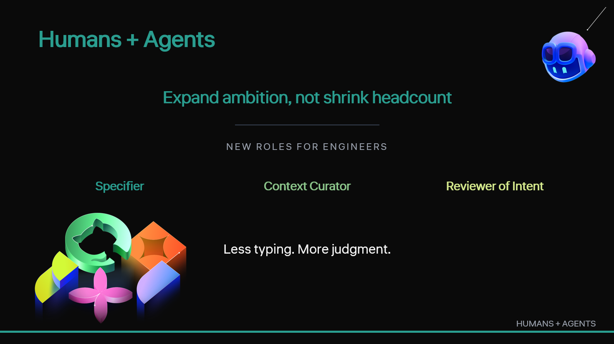
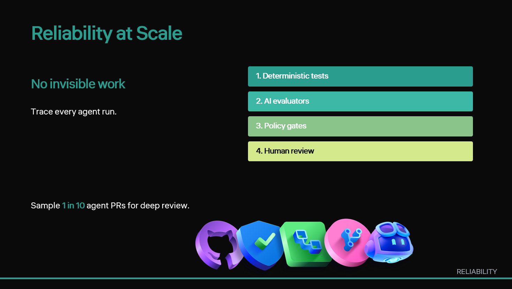
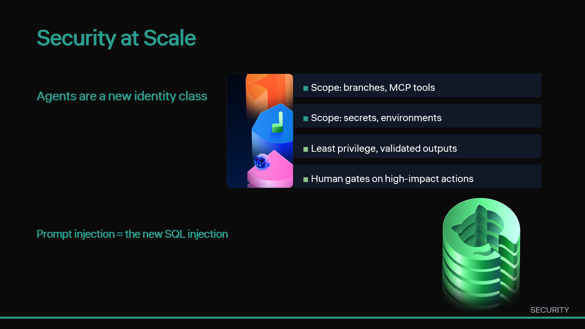
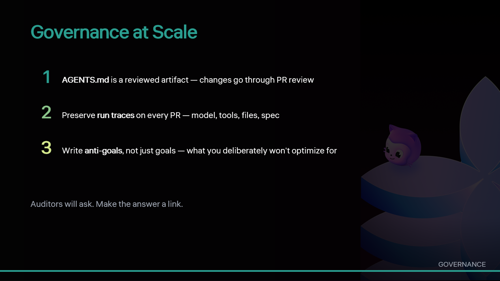
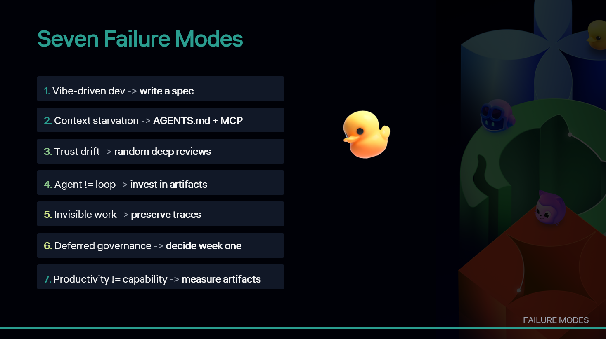
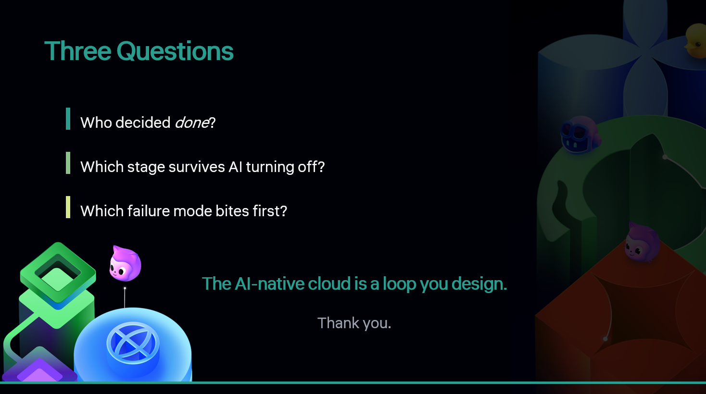

  

    
Asia DevOps Conference Series

    <h1>Building the AI-Native Cloud</h1>
    
A responsive MkDocs site with one chapter for each slide, accessible light and dark modes, and the talk content laid out under every hero image.

    

            <a class="button button--primary" href="chapters/01-title/">Start with the opener</a>
      <a class="button button--secondary" href="#chapters">Browse chapters</a>
    

  

<section class="home-strip" aria-label="Site features">
  

    <strong>Accessible</strong>
    Semantic markup, strong contrast, visible focus states.
  

  

    <strong>Responsive</strong>
    Cards and hero images reflow cleanly from mobile to desktop.
  

  

    <strong>Theme switch</strong>
    Light mode stays white with black text. Dark mode stays black with white text.
  

</section>

## Chapters

<a class="chapter-card" href="chapters/01-title/" aria-label="Open 01. Building the AI-Native Cloud">
  
  

    
Chapter 01

    <h2 class="chapter-card__title">Building the AI-Native Cloud</h2>
    
Set the frame: this is not a Copilot demo, this is an architecture conversation.

  

</a>
<a class="chapter-card" href="chapters/02-the-quiet-shift/" aria-label="Open 02. The Quiet Shift">
  
  

    
Chapter 02

    <h2 class="chapter-card__title">The Quiet Shift</h2>
    
Something already changed. Most teams haven't noticed.

  

</a>
<a class="chapter-card" href="chapters/03-three-eras-side-by-side/" aria-label="Open 03. Three Eras, Side by Side">
  
  

    
Chapter 03

    <h2 class="chapter-card__title">Three Eras, Side by Side</h2>
    
Give the audience a vocabulary so they can locate themselves on the map.

  

</a>
<a class="chapter-card" href="chapters/04-defining-ai-native/" aria-label="Open 04. Defining AI-Native">
  
  

    
Chapter 04

    <h2 class="chapter-card__title">Defining AI-Native</h2>
    
A definition you can hold a team accountable to.

  

</a>
<a class="chapter-card" href="chapters/05-the-six-stage-loop/" aria-label="Open 05. The Six-Stage Loop">
  
  

    
Chapter 05

    <h2 class="chapter-card__title">The Six-Stage Loop</h2>
    
Show the anatomy. This is the spine of the rest of the talk.

  

</a>
<a class="chapter-card" href="chapters/06-cloud-native-gave-us-the-substrate/" aria-label="Open 06. Cloud-Native Gave Us the Substrate">
  
  

    
Chapter 06

    <h2 class="chapter-card__title">Cloud-Native Gave Us the Substrate</h2>
    
Honour the audience's existing investments. AI-native rides on top of cloud-native, it doesn't replace it.

  

</a>
<a class="chapter-card" href="chapters/07-new-workflows-spec-driven-development/" aria-label="Open 07. New Workflows: Spec-Driven Development">
  
  

    
Chapter 07

    <h2 class="chapter-card__title">New Workflows: Spec-Driven Development</h2>
    
The spec is the durable artifact. Code is downstream.

  

</a>
<a class="chapter-card" href="chapters/08-new-workflows-context-engineering/" aria-label="Open 08. New Workflows: Context Engineering">
  
  

    
Chapter 08

    <h2 class="chapter-card__title">New Workflows: Context Engineering</h2>
    
Context is the second-most-important investment after the spec.

  

</a>
<a class="chapter-card" href="chapters/09-new-operating-model-humans-agents/" aria-label="Open 09. New Operating Model: Humans + Agents">
  
  

    
Chapter 09

    <h2 class="chapter-card__title">New Operating Model: Humans + Agents</h2>
    
Roles change. Headcount doesn't have to shrink. Ambition should expand.

  

</a>
<a class="chapter-card" href="chapters/10-reliability-at-scale/" aria-label="Open 10. Reliability at Scale">
  
  

    
Chapter 10

    <h2 class="chapter-card__title">Reliability at Scale</h2>
    
Reliability isn't threatened by agents. It's threatened by *invisible* agents.

  

</a>
<a class="chapter-card" href="chapters/11-security-at-scale/" aria-label="Open 11. Security at Scale">
  
  

    
Chapter 11

    <h2 class="chapter-card__title">Security at Scale</h2>
    
Agents are a new identity class. Treat them like one.

  

</a>
<a class="chapter-card" href="chapters/12-governance-at-scale/" aria-label="Open 12. Governance at Scale">
  
  

    
Chapter 12

    <h2 class="chapter-card__title">Governance at Scale</h2>
    
Governance designed on day one is cheap. Governance bolted on after an incident is expensive.

  

</a>
<a class="chapter-card" href="chapters/13-seven-failure-modes/" aria-label="Open 13. Seven Failure Modes">
  
  

    
Chapter 13

    <h2 class="chapter-card__title">Seven Failure Modes</h2>
    
Pattern-match these now. Save yourself a quarter.

  

</a>
<a class="chapter-card" href="chapters/14-one-page-memo/" aria-label="Open 14. One-Page Memo">
  
  

    
Chapter 14

    <h2 class="chapter-card__title">One-Page Memo</h2>
    
Give them something they can implement on Monday.

  

</a>
<a class="chapter-card" href="chapters/15-close-and-three-questions/" aria-label="Open 15. Close and Three Questions">
  
  

    
Chapter 15

    <h2 class="chapter-card__title">Close and Three Questions</h2>
    
Leave them with questions they cannot un-ask.

  

</a>

